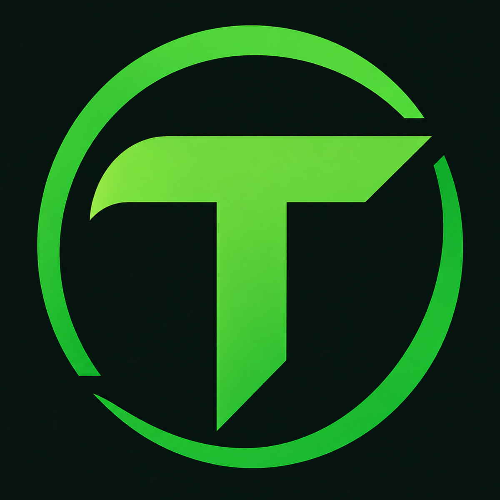
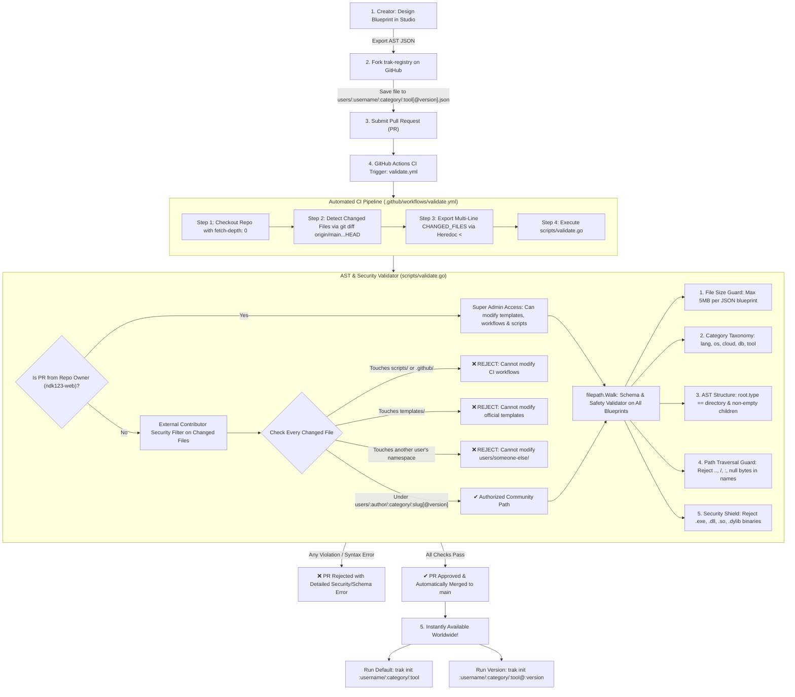
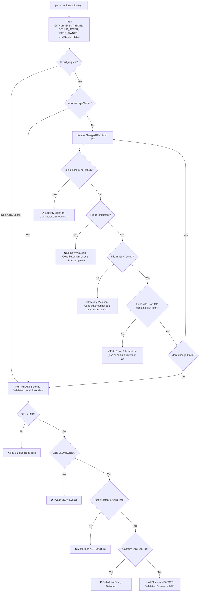

<p align="center">
  
</p>

<h1 align="center">Trak Registry</h1>

<p align="center">
  <strong>Decoupled GitOps Curriculum Catalog & Blueprint Engine for Trak CLI</strong>
</p>

<p align="center">
  <a href="registry.json"></a>
  <a href="templates/"></a>
  <a href="users/"></a>
  <a href="https://github.com/ndk123-web/trak"></a>
  <a href="LICENSE"></a>
</p>

---

## ⚡ Overview

**Trak Registry** is the central, open-source curriculum catalog for the [Trak CLI](https://github.com/ndk123-web/trak) ecosystem. It hosts declarative Abstract Syntax Tree (AST) blueprints that define comprehensive, multi-module learning environments with real source code, build configs, and hands-on exercises.

By decoupling curriculum blueprints from the CLI binary, new learning tracks, updates, and community contributions are **streamed instantly** to users globally without requiring CLI recompilation, database migrations, or server maintenance.

---

## 🎬 Demo

<p align="center">
  <video src="https://github.com/user-attachments/assets/4210baaf-ef0d-469b-9a8a-f0e244d9b9a3" controls="controls" width="100%" style="max-width: 900px; border-radius: 12px;"></video>
</p>

---

## 🗂️ 2-Tier Registry Hierarchy

Trak Registry separates verified core curricula from decentralized community tracks using two clear filesystem tiers:

```text
trak-registry/
├── registry.json                 # Master catalog index for official tracks
├── templates/                    # 📦 Tier 1: Official Curriculums (Maintained by Core Team)
│   ├── lang/                     # Programming Languages (go, rust, python, typescript, c, cpp, java...)
│   ├── os/                       # Operating Systems (linux, macos, windows)
│   ├── cloud/                    # Cloud Platforms (aws)
│   ├── db/                       # Databases & Storage (postgres, redis, sql)
│   └── tool/                     # DevOps Tools (docker, k8s, terraform, git, jenkins, ansible)
│
└── users/                        # 🌐 Tier 2: Community GitOps Blueprints (Open to All Creators)
    ├── [github-username-1]/      # Isolated Creator Namespace (e.g. ndk123-web/)
    │   ├── lang/
    │   │   ├── go.json           # Default / Latest track
    │   │   └── go@v1.2.0.json    # Explicit Versioned release
    │   └── db/
    │       └── postgres.json
    └── [github-username-2]/
        └── db/
            └── postgres@v1.0.0   # Tagged version release
```

---

## 🔄 End-to-End GitOps Contribution & CI Verification Workflow

Publishing custom learning tracks to Trak Registry requires **zero custom accounts, zero passwords, and zero API keys**. The entire lifecycle is governed by automated GitOps and GitHub Actions CI:



---

## 🛡️ Detailed Validation Stages in `scripts/validate.go`



---

## 🏷️ Multi-Version Blueprints Support (`@version`)

Creators can publish and maintain **multiple versions** of their curriculum simultaneously. This allows breaking changes, new framework versions, or beginner vs advanced editions without breaking existing learners:

| Storage Path in Registry | CLI Command to Initialize | Description |
| :--- | :--- | :--- |
| `users/ndk123-web/lang/go.json` | `trak init ndk123-web/lang/go` | **Default / Latest** Go curriculum |
| `users/ndk123-web/lang/go@v1.2.0.json` | `trak init ndk123-web/lang/go@v1.2.0` | **Version 1.2.0** explicit release |
| `users/Ndk18-wesd/db/postgres@v1.0.0` | `trak init Ndk18-wesd/db/postgres@v1.0.0` | **Version 1.0.0** tagged release |
| `templates/lang/go.json` | `trak init lang/go` | Official Core Go track |

---

## 🛠️ Step-by-Step Community Publishing Guide

### Step 1: Design in Blueprint Studio
Instead of writing hundreds of lines of nested JSON manually with escaped newlines and quotes, use **Blueprint Studio** directly in your browser:
1. Open [Blueprint Studio](https://trak-web.vercel.app/studio) (or run `trak-web` locally).
2. Scaffold your directories, add starter files, and write code in Monaco Editor.
3. Click **"Download AST JSON"** to export your valid template.

### Step 2: Fork the Repository
Fork [`github.com/ndk123-web/trak-registry`](https://github.com/ndk123-web/trak-registry) to your own GitHub account.

### Step 3: Place in Your Isolated User Namespace
Create your blueprint file using the exact directory structure:

```text
# Default / unversioned track:
users/<your-github-username>/<category>/<tool>.json

# OR explicit versioned track:
users/<your-github-username>/<category>/<tool>@<version>.json
```

> **Allowed Categories:** `lang` (languages), `os` (operating systems), `cloud` (cloud infra), `db` (databases), `tool` (DevOps tools).

### Step 4: Submit Pull Request (PR)
1. Push your branch and open a PR against `main`.
2. GitHub Actions CI will automatically run the validator.
3. Once merged, anyone across the globe can immediately run:
   ```bash
   # Default track:
   trak init <your-github-username>/<category>/<tool>

   # OR specific version:
   trak init <your-github-username>/<category>/<tool>@<version>
   ```

---

## 📄 Blueprint AST Schema Specification

Every blueprint JSON file represents a recursive Abstract Syntax Tree (AST) defining the materialized workspace:

```json
{
  "id": "lang/go",
  "name": "Go (Golang) Comprehensive Mastery Track",
  "version": "1.2.0",
  "description": "Complete Go curriculum from fundamentals to production concurrency",
  "root": {
    "name": "go-workspace",
    "type": "directory",
    "children": [
      {
        "name": "go.mod",
        "type": "file",
        "content": "module learn-go\n\ngo 1.22\n"
      },
      {
        "name": "00-setup-and-prerequisites",
        "type": "directory",
        "children": [
          {
            "name": "README.md",
            "type": "file",
            "content": "# 00 - Setup & Toolchain\n\n## 🎯 Learning Objectives\n..."
          },
          {
            "name": "main.go",
            "type": "file",
            "content": "package main\n\nimport \"fmt\"\n\nfunc main() {\n\tfmt.Println(\"Hello, Trak!\")\n}\n"
          }
        ]
      }
    ]
  }
}
```

### Node Schema Fields:
| Field | Type | Description |
| :--- | :--- | :--- |
| `name` | `string` | File or directory name (e.g. `main.go`, `01-basics`). Cannot contain path traversal characters. |
| `type` | `string` | Node type: `"directory"` or `"file"`. |
| `content` | `string` | *(Files only)* Raw UTF-8 string content with escaped newlines. |
| `children` | `array[Node]` | *(Directories only)* Nested list of child file and directory nodes. |

---

## 📚 Master Blueprint Matrix (19 Official Tracks)

| Category | Identifier | Name | Modules | Version | Source File |
| :--- | :--- | :--- | :---: | :---: | :--- |
| **`lang/`** | `lang/go` | Go (Golang) | 20 | `1.2.0` | [`templates/lang/go.json`](templates/lang/go.json) |
| **`lang/`** | `lang/rust` | Rust Systems | 19 | `1.0.0` | [`templates/lang/rust.json`](templates/lang/rust.json) |
| **`lang/`** | `lang/typescript` | TypeScript Fullstack | 19 | `1.0.0` | [`templates/lang/typescript.json`](templates/lang/typescript.json) |
| **`lang/`** | `lang/python` | Python Architecture | 19 | `1.0.0` | [`templates/lang/python.json`](templates/lang/python.json) |
| **`lang/`** | `lang/javascript` | JavaScript & Node.js | 19 | `1.0.0` | [`templates/lang/javascript.json`](templates/lang/javascript.json) |
| **`lang/`** | `lang/java` | Java & JVM Systems | 19 | `1.0.0` | [`templates/lang/java.json`](templates/lang/java.json) |
| **`lang/`** | `lang/cpp` | Modern C++ (C++23) | 19 | `1.0.0` | [`templates/lang/cpp.json`](templates/lang/cpp.json) |
| **`lang/`** | `lang/c` | C Low-Level Systems | 19 | `1.0.0` | [`templates/lang/c.json`](templates/lang/c.json) |
| **`os/`** | `os/linux` | Linux Systems & Bash | 19 | `1.0.0` | [`templates/os/linux.json`](templates/os/linux.json) |
| **`os/`** | `os/macos` | macOS & Darwin XNU | 19 | `1.0.0` | [`templates/os/macos.json`](templates/os/macos.json) |
| **`os/`** | `os/windows` | Windows & PowerShell | 19 | `1.0.0` | [`templates/os/windows.json`](templates/os/windows.json) |
| **`cloud/`** | `cloud/aws` | AWS Cloud Architecture | 19 | `1.2.0` | [`templates/cloud/aws.json`](templates/cloud/aws.json) |
| **`db/`** | `db/postgres` | PostgreSQL & DBA | 19 | `1.0.0` | [`templates/db/postgres.json`](templates/db/postgres.json) |
| **`db/`** | `db/redis` | Redis In-Memory Engine | 19 | `1.0.0` | [`templates/db/redis.json`](templates/db/redis.json) |
| **`db/`** | `db/sql` | Comprehensive SQL | 19 | `1.0.0` | [`templates/db/sql.json`](templates/db/sql.json) |
| **`tool/`** | `tool/docker` | Docker Containers | 19 | `1.0.0` | [`templates/tool/docker.json`](templates/tool/docker.json) |
| **`tool/`** | `tool/k8s` | Kubernetes (CKA/CKAD) | 19 | `1.0.0` | [`templates/tool/k8s.json`](templates/tool/k8s.json) |
| **`tool/`** | `tool/terraform` | Terraform Infrastructure | 19 | `1.0.0` | [`templates/tool/terraform.json`](templates/tool/terraform.json) |
| **`tool/`** | `tool/ansible` | Ansible Automation | 19 | `1.0.0` | [`templates/tool/ansible.json`](templates/tool/ansible.json) |
| **`tool/`** | `tool/git` | Git Internals & Workflows | 19 | `1.0.0` | [`templates/tool/git.json`](templates/tool/git.json) |
| **`tool/`** | `tool/jenkins` | Jenkins CI/CD Pipelines | 19 | `1.0.0` | [`templates/tool/jenkins.json`](templates/tool/jenkins.json) |

---

## 🧪 Local Schema Validation

You can run the official registry validator locally before opening a PR:

```bash
# From trak-registry repository root
go run scripts/validate.go
```

---

## 📜 Ecosystem & License

- ⚡ **[Trak CLI](https://github.com/ndk123-web/trak)** — The official Go binary workspace generator.
- 🌐 **[Trak Web](https://github.com/ndk123-web/trak-web)** — The interactive web portal and Blueprint Studio.

This project is licensed under the **MIT License**.
